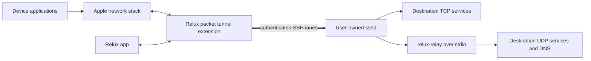
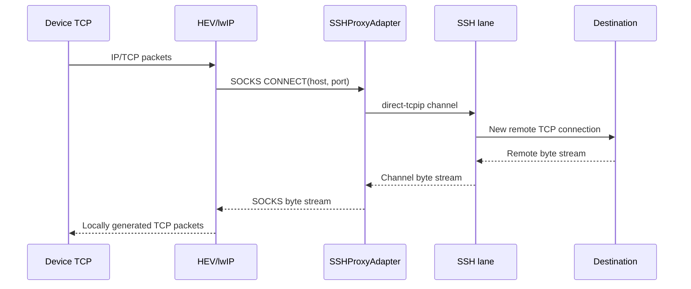

# System architecture

## Context

The containing app manages profiles and the system VPN configuration. A packet
tunnel extension owns the complete live transport. It terminates device TCP in a
userspace stack, opens corresponding SSH `direct-tcpip` channels, and sends
framed UDP datagrams to a rootless relay launched through an SSH exec channel.

The only user-payload transport between the Apple device and the selected exit
host is SSH. Normal SSH TCP control traffic is visible to the access network;
payload destinations and contents are protected by SSH up to the exit host.

## Runtime components

### Containing apps

The iOS app and macOS app provide profile editing, key import/generation,
host-key confirmation, VPN installation, connect/disconnect, status, and
diagnostics. They use `NETunnelProviderManager` to manage the custom VPN profile.
They are not part of the live packet path.

### Packet tunnel extensions

Each platform embeds an `NEPacketTunnelProvider` target. The provider owns:

- route and DNS settings;
- `NEPacketTunnelFlow` reads and writes;
- the packet bridge and HEV/lwIP instance;
- the internal SOCKS adapter;
- SSH lane connections and channels;
- remote relay installation and session;
- reconnect, memory pressure, and capability state machines.

The iOS and macOS providers share `ReluxTunnelCore` as a Swift package. Platform
adapters remain thin and do not duplicate the packet or SSH state machines.

### Packet plane

`NEPacketTunnelFlow` exchanges packets with HEV/lwIP through a documented
`AF_UNIX/SOCK_DGRAM` socket pair. HEV terminates TCP locally and speaks an
in-process SOCKS contract to `SSHProxyAdapter`.

### SSH transport

`SSHTransport` abstracts the chosen in-process engine. It provides authenticated
connections, `direct-tcpip`, exec channels, host-key evidence, transport metrics,
rekey controls, and per-channel window configuration. It does not provide SFTP.

### Remote relay

`relux-relay` is a small bundled program uploaded through an authenticated exec
channel and launched with `--stdio`. It performs only UDP socket operations,
protocol framing, bounded association tracking, and health reporting. It does
not require root, persist as a daemon, or open a listening port.

## Data paths

### TCP

The original TCP connection terminates in lwIP. The SSH server opens a distinct
destination TCP connection. This avoids nesting an intact TCP congestion loop
inside SSH's TCP connection, although all flows on one SSH lane still share its
head-of-line blocking.

### UDP and DNS

HEV uses its UDP-in-TCP SOCKS extension. `SSHProxyAdapter` preserves the HEV
datagram address framing where practical and forwards it through the relay exec
channel. The relay opens real UDP sockets on the exit host and returns replies
with the same association identity.

DNS uses a tunnel-controlled resolver path. It never falls back silently to the
physical interface. In degraded mode it uses DNS-over-TCP through
`direct-tcpip` to an explicit numeric resolver endpoint configured by the user.
DoH is not a baseline resolver kind and requires a separate trust/bootstrap ADR.

## Control and state ownership

The extension is the authority for live state. The containing app persists
profiles and requests actions but derives connection status from
`NETunnelProviderSession` plus a versioned app-message snapshot. Shared mutable
state is limited to an App Group configuration snapshot and Keychain references.

## Platform-intent gate

Apple documents packet tunnel providers as packet-oriented custom VPNs whose
packets are sent to a tunnel server. Apple Technical Note TN3120 warns against
claiming packet traffic and proxying it through another interface. Relux's
local TCP termination followed by SSH `direct-tcpip` may be interpreted as that
discouraged model even though SSH is the custom tunnel and the exit is remote.

**Gate A0:** obtain evidence that this architecture is acceptable for the
intended Network Extension entitlement and App Store distribution. Evidence may
be a written Apple Developer Technical Support response, successful
entitlement/review feedback for an accurately disclosed prototype, or an
architecture change that sends packet semantics to a remote VPN endpoint. This
is a release viability gate, not a hidden implementation assumption.

**Scope of Gate A0 (re-scoped 2026-07-28 by ADR-013/ADR-024).** A0 is an App
Store / App Review release gate. It is **deferred** for the macOS prototype goal
and does **not** gate product implementation on that path: the goal ships a
Developer ID-signed, notarized, directly-distributed macOS build, which does not
pass through App Review. A0 stays **mandatory** before iOS submission and before
any public macOS distribution claim that depends on App Store acceptance. Its
task branch (`TASK-260715-1o3q6l` → `TASK-260715-1i6bh7` → `TASK-260715-1828xy`)
carries `blocked` status with an evidence packet per ADR-027, so no scheduler can
pull A0 research onto the prototype critical path. Nothing about the deferral
weakens the architecture question itself; it is re-armed unchanged when App
Store distribution resumes.

Primary Apple references are recorded in
[`../.research/260715_platform-upstream-verification.md`](../.research/260715_platform-upstream-verification.md).
