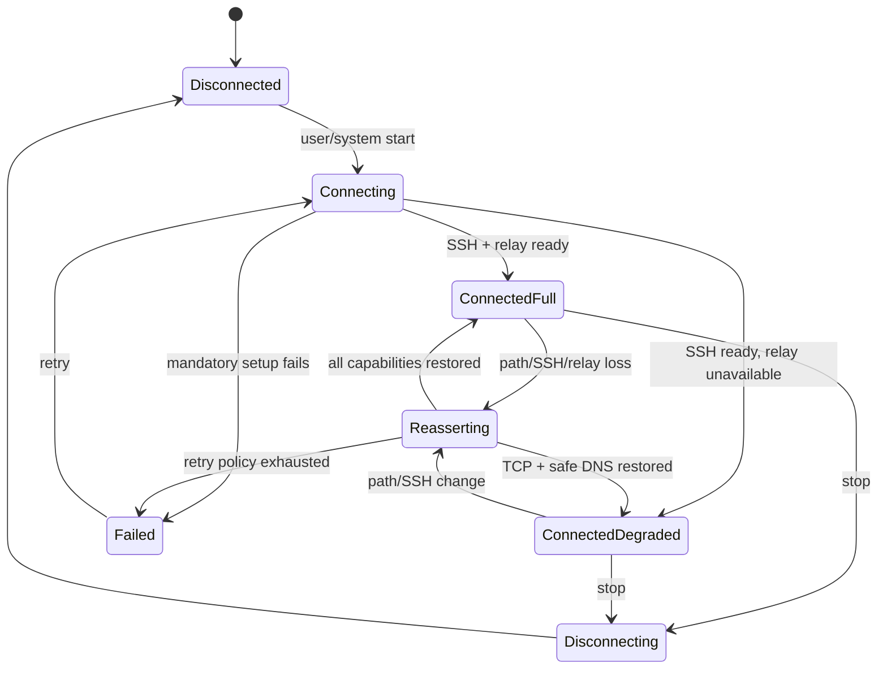

# Routing, DNS, and lifecycle specification

## Tunnel startup order

The SSH transport must not route into its own tunnel. Startup is ordered:

1. Load and validate a profile and Keychain references.
2. Determine the current physical path and candidate interfaces.
3. Resolve and connect the SSH host before installing default tunnel routes.
4. Verify the server host key and authenticate.
5. Record the actual connected IP from `NWConnection.currentPath.remoteEndpoint`,
   including IPv4, IPv6, or synthesized NAT64 endpoint.
6. Start the mandatory control lane and packet plane; probe relay capability.
7. Apply IPv4/IPv6 tunnel addresses, DNS settings, default included routes, and
   explicit endpoint exclusions where the platform mode requires them.
8. Start packet reads and report full or degraded connected state.
9. Open optional general/bulk SSH lanes within the memory budget.

An endpoint exclusion is a host route, not a broad subnet. The implementation
MUST validate Apple's automatic tunnel-server exclusion behavior on every
supported platform/mode rather than assume one routing configuration fits all.

## DNS

The provider installs only a tunnel-owned DNS configuration. A local DNS
component accepts IPv4/IPv6 UDP and TCP requests from the virtual network and
forwards them through the exit host:

- full mode: UDP through `relux-relay`, with TCP fallback;
- degraded mode: DNS-over-TCP using `direct-tcpip` to the configured resolver,
  or DoH over a tunneled TCP connection;
- bootstrap: resolve the SSH hostname on the physical path before tunnel routes
  apply and cache the candidate/actual endpoint for reconnect.

No resolver failure may silently send ordinary DNS to the physical interface.
Caching is bounded by entry count and TTL. Negative caching and truncation/TC
fallback follow DNS semantics. Destination logging is disabled by default.

Fake DNS is optional and not required for the baseline. If introduced for
destination metadata or routing, it requires a separate collision, cache,
IPv6, and privacy design.

## Route modes

### Compatible

Uses default IPv4/IPv6 included routes with only the exclusions needed for the
SSH tunnel endpoint and platform services selected by the user. It prioritizes
connectivity and captive-network recovery while still preventing ordinary DNS
fallback.

### Fail-closed

Uses `includeAllNetworks` where supported and keeps ordinary application traffic
scoped to the VPN during reconnect. This mode is fail-closed only within the
scope Apple provides: DHCP, captive-portal negotiation, certain cellular
services, companion-device traffic, and traffic needed to maintain the VPN may
always be excluded by the system. The UI and privacy documentation MUST state
these exceptions.

Apple currently documents captive negotiation as always excluded, so the app
does not claim a cryptographically absolute kill switch. Tests MUST cover actual
behavior on supported OS releases and detect API changes.

## Reconnect state machine

During reconnect the provider sets `reasserting = true`. It stops assigning new
flows to failed lanes and does not leak them to the physical route.

Reconnect sequence:

1. Observe path change, transport failure, sleep/wake, or viability loss.
2. Preserve the last verified host identity and candidate IPs; invalidate lane
   state and relay associations.
3. Try cached endpoint IPs on the new physical path.
4. If fresh resolution is needed, create an `NWConnection` with
   `NWParameters.requiredInterface` set to the selected physical interface so
   the lookup/connect cannot deadlock in the stale tunnel.
5. Capture the actual new remote endpoint, rebuild its route exclusion, and
   apply network settings atomically with the new transport.
6. Restore mandatory lane A, safe DNS, packet plane, relay capability, and then
   optional lanes.
7. Set `reasserting = false` only after the advertised capability mode is usable.

Old and new transports MUST NOT coexist with full channel windows beyond the
explicit reconnect memory budget. At the critical memory watermark, release the
old transport before opening the replacement.

## Retry and failure policy

Backoff is bounded, jittered, and reset after a stable connection. Authentication
and host-key mismatch do not retry indefinitely. Path-unavailable and transient
connect failures may retry while the system expects VPN continuity. A user stop
cancels all retries promptly and waits for descriptor/task cleanup before
reporting disconnected.
