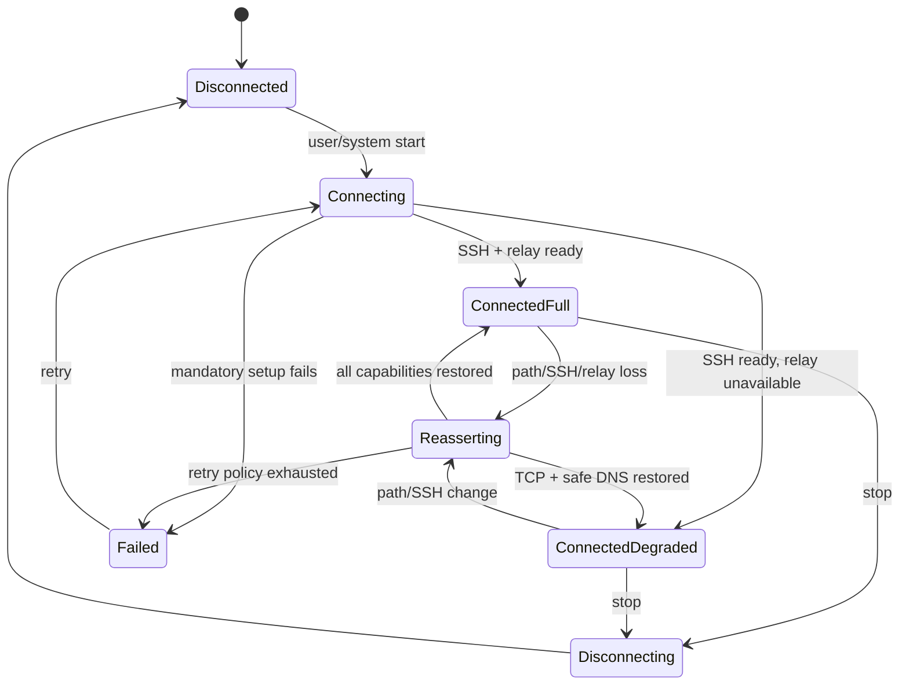

# Routing, DNS, and lifecycle specification

## Tunnel startup order

The SSH transport must not route into its own tunnel. Startup is ordered:

1. Load and validate a profile and Keychain references.
2. Determine the current physical path and candidate interfaces.
3. Resolve and connect the SSH host before installing default tunnel routes.
4. Verify the server host key and authenticate.
5. Record the actual connected IP from `NWConnection.currentPath.remoteEndpoint`,
   including IPv4, IPv6, or synthesized NAT64 endpoint.
6. Start the mandatory control lane and packet plane; probe relay capability.
7. Apply IPv4/IPv6 tunnel addresses, DNS settings, default included routes, and
   explicit endpoint exclusions where the platform mode requires them.
8. Start packet reads and report full or degraded connected state.
9. Open optional general/bulk SSH lanes within the memory budget.

An endpoint exclusion is a host route, not a broad subnet. The implementation
MUST validate Apple's automatic tunnel-server exclusion behavior on every
supported platform/mode rather than assume one routing configuration fits all.

## DNS

The provider installs only a tunnel-owned DNS configuration. A local DNS
component accepts IPv4/IPv6 UDP and TCP requests from the virtual network and
forwards them through the exit host:

- full mode: UDP through `relux-relay`, with TCP fallback;
- degraded mode: DNS-over-TCP using `direct-tcpip` to the configured numeric
  resolver; and
- bootstrap: resolve the SSH hostname on the physical path before tunnel routes
  apply and cache the candidate/actual endpoint for reconnect.

No resolver failure may silently send ordinary DNS to the physical interface.
Caching is bounded by entry count and TTL. Negative caching and truncation/TC
fallback follow DNS semantics. Destination logging is disabled by default.

Fake DNS is optional and not required for the baseline. If introduced for
destination metadata or routing, it requires a separate collision, cache,
IPv6, and privacy design.

### Baseline exit-resolver policy

The baseline resolver is an ordered, explicit per-profile non-empty list of
numeric IPv4 and/or IPv6 DNS endpoints. The profile has no resolver default.
Resolver hostnames, physical-path resolver inheritance, public-vendor defaults,
exit-host discovery, and DoH are not baseline fallback mechanisms.

The versioned non-secret profile/provider snapshot carries this exact object:

```json
{
  "dnsResolver": {
    "schemaVersion": 1,
    "kind": "dns53",
    "endpoints": [
      { "address": "127.0.0.1", "port": 53 },
      { "address": "::1", "port": 53 }
    ]
  }
}
```

`schemaVersion`, `kind`, and a non-empty `endpoints` array are required and
have no default. `address` is a required canonical numeric literal; `port`
defaults to 53 and otherwise accepts 1 through 65535. Address family is derived
from the parsed literal. The stored order is the failover order; the device's
physical address family does not reorder it because the SSH exit opens the
resolver connection. Loopback, private, and unique-local destinations are
allowed deliberately. Unspecified, multicast, limited-broadcast, IPv4/IPv6
link-local, scoped, mapped, non-canonical, duplicate, and hostname values are
rejected by the stored-snapshot validator before credential access or route
installation. Profile-editor input may accept an alternate valid textual form
only when it canonicalizes it before persistence. The production endpoint-count
ceiling is not a profile default or an ADR-022 constant: it is supplied by the
accepted injected `DNSRuntimePolicyV1` selected by `TASK-260721-3miqh4` and is
validated consistently by the editor, publisher, snapshot loader, and runtime.

M1 transport is DNS-over-TCP through `direct-tcpip` on the authenticated SSH
session. One runtime configuration generation has one active endpoint and at
most one reusable TCP connection. The connection epoch owns unique upstream
message IDs, question correlation, bounded pipelining, response dispatch, and
tombstones for cancelled work; a client sees at most one terminal result.

Every numeric endpoint count, DNS message size, byte budget, in-flight/queued
capacity, channel-open/response/logical/startup/idle deadline default, and hard
ceiling belongs to injected `DNSRuntimePolicyV1`, not the profile. Production
composition has no built-in fallback values. `TASK-260721-3miqh4` publishes a
non-authoritative measurement candidate: default 4 endpoints, 65,535 DNS
message bytes, 16 live owners, 256 KiB queued wire, 4 MiB aggregate DNS, and
2/5/5/1/35/10/10-second channel-open/response/relay-UDP/dispatch/logical/
startup/idle values; candidate hard envelope 8 endpoints, 32 owners, 1 MiB
queued wire, 8 MiB aggregate, and 5/10/10/2/135/45/30-second values. The exact
local ledgers are 3,686,706 and 7,635,554 bytes. These values are not production
defaults or accepted hard caps: selected-SSH `direct-tcpip` evidence and an
accepted ADR-009 residual DNS component ledger do not yet exist. Machine policy
sets `productionAuthorization.permitted=false`; consumers must remain blocked.
Artifact verification also requires the exact non-authoritative candidate class,
both false authorization booleans, blocker identities `TASK-260715-1gjxer` and
`TASK-260715-1pn983`, the declared later physical evidence gate, structural
attempt/equation/metadata contracts, and wire vectors. Missing or changed
authority structure fails closed. Default and hard timing rows are exercised by
20 one-field mutations through the real validator, and reliability evidence is
accepted only when every scenario matches its exact attempt, endpoint, terminal,
duplicate, late, cancellation, tombstone, epoch, retry-batch, trace, and cleanup
projection.

Policy validation requires startup to cover `E×open + dispatch`; M1 ready and
cold paths to cover response/open slices; M2 ready and cold paths to add one
bounded relay/UDP phase; queued bytes to remain below aggregate bytes; and the
exact ledger to fit the aggregate. One owner reserves its encoded request,
maximum response, two-byte framing for each, one framed retry request, and
1,024 bytes of correlation/tombstone metadata. The component also reserves one
65,537-byte read buffer, one 65,537-byte write buffer, 64 KiB manager state,
64 KiB diagnostics, 64 bytes per endpoint, and queued wire capacity.
Inconsistent combinations fail closed. The task-scoped authority is
`.research/260721_task-260721-3miqh4-dns-runtime-policy-v1.md` with machine
vectors under `.research/fixtures/` and controlled measurements under
`.research/raw/`.

Only standard idempotent DNS QUERY operations are accepted in the baseline.
A complete valid response, including any error RCODE, is authoritative and does
not cause resolver shopping. EOF, framing/correlation failure, response timeout,
or SSH/channel failure atomically retires the connection epoch. Already terminal,
cancelled, or expired queries do not retry. One manager gathers the remaining
eligible queries in admission order, opens the next not-yet-attempted configured
endpoint once, and replays each eligible query at most once there; future queries
queue or fail within the injected bounds. Endpoint promotion is generation-wide,
invalidates the cache/transport generation, and rejects every late callback from
the retired epoch. There is no per-query connection reopen or endpoint selection.
Exhaustion returns bounded SERVFAIL when possible, marks safe DNS unhealthy,
withdraws usable capability, and invokes route/settings teardown. It never opens
a physical DNS socket or asks the OS resolver for the ordinary query.

M2 full mode sends at most one relay UDP transmission for an eligible client-UDP
query to the active endpoint. M2 alone may request a same-endpoint TCP retry after
TC=1, a local/negotiated relay-datagram size failure before a valid response, UDP
response timeout, or a typed relay association/session failure. Client-TCP DNS
goes directly to M1 TCP. Once handed off, M1 owns TCP reuse and may promote only
after TCP transport/protocol failure, attempting each later configured endpoint
at most once. Thus a logical M2 query has at most one UDP attempt plus one TCP
attempt per configured endpoint under one injected deadline; a valid DNS response
at either transport ends the query. Malformed/mismatched UDP data does not trigger
resolver shopping.

The tunnel is a non-validating DNS proxy: it preserves query semantics and
DNSSEC-related flags and records, apart from transaction-ID correlation and
protocol-correct cache TTL aging. It does not claim DNSSEC validation. A profile
or resolver identity change invalidates the DNS cache generation.

Profiles without `dnsResolver` do not migrate by inference. They remain stored
but are disabled with `requiresResolverConfiguration` until the user supplies at
least one endpoint. No migration copies a physical resolver or chooses a public
resolver. Unsupported future resolver kinds fail before routes. The task-scoped
decision and option analysis are in
[`../.research/260721_task-260715-1tnjlu-exit-dns-resolver-policy.md`](../.research/260721_task-260715-1tnjlu-exit-dns-resolver-policy.md).
Production publication also remains gated on the accepted numeric policy from
`TASK-260721-3miqh4`; no repository, UI, or runtime layer invents local limits.

## Route modes

### Compatible

Uses default IPv4/IPv6 included routes with only the exclusions needed for the
SSH tunnel endpoint and platform services selected by the user. It prioritizes
connectivity and captive-network recovery while still preventing ordinary DNS
fallback.

### Fail-closed

Uses `includeAllNetworks` where supported and keeps ordinary application traffic
scoped to the VPN during reconnect. This mode is fail-closed only within the
scope Apple provides: DHCP, captive-portal negotiation, certain cellular
services, companion-device traffic, and traffic needed to maintain the VPN may
always be excluded by the system. The UI and privacy documentation MUST state
these exceptions.

Apple currently documents captive negotiation as always excluded, so the app
does not claim a cryptographically absolute kill switch. Tests MUST cover actual
behavior on supported OS releases and detect API changes.

## Reconnect state machine



During reconnect the provider sets `reasserting = true`. It stops assigning new
flows to failed lanes and does not leak them to the physical route.

Reconnect sequence:

1. Observe path change, transport failure, sleep/wake, or viability loss.
2. Preserve the last verified host identity and candidate IPs; invalidate lane
   state and relay associations.
3. Try cached endpoint IPs on the new physical path.
4. If fresh resolution is needed, create an `NWConnection` with
   `NWParameters.requiredInterface` set to the selected physical interface so
   the lookup/connect cannot deadlock in the stale tunnel.
5. Capture the actual new remote endpoint, rebuild its route exclusion, and
   apply network settings atomically with the new transport.
6. Restore mandatory lane A, safe DNS, packet plane, relay capability, and then
   optional lanes.
7. Set `reasserting = false` only after the advertised capability mode is usable.

Old and new transports MUST NOT coexist with full channel windows beyond the
explicit reconnect memory budget. At the critical memory watermark, release the
old transport before opening the replacement.

## Retry and failure policy

Backoff is bounded, jittered, and reset after a stable connection. Authentication
and host-key mismatch do not retry indefinitely. Path-unavailable and transient
connect failures may retry while the system expects VPN continuity. A user stop
cancels all retries promptly and waits for descriptor/task cleanup before
reporting disconnected.
